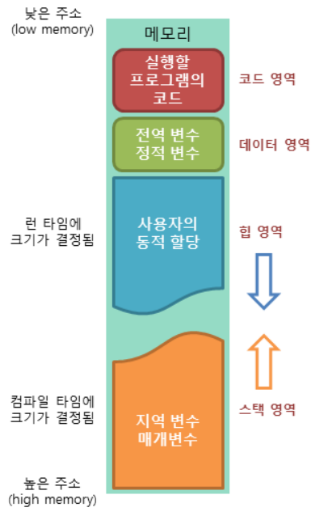

### 코드 영역

실행할 프로그램의 코드가 저장되는 영역으로 텍스트 영역이라고도 부릅니다. 사용자가 프로그램 실행 명령을 내리면 OS가 HDD에서 메모리로 실행 코드를 올리게 되고, CPU는 코드 영역에 저장된 명령어를 하나씩 처리하게 됩니다.

### 데이터 영역

프로그램의 전역 변수(global)와 정적 변수(static)가 저장되는 영역입니다. 데이터 영역은 프로그램의 시작과 함께 할당되며, 프로그램이 종료되면 소멸합니다.

### 힙 영역

프로그래머가 직접 관리할 수 있는 메모리 영역으로 이 공간에 메모리를 할당하는 것을 동적 할당이라고 부릅니다. Java에서는 가비지 컬렉터가 자동으로 해제해줍니다. 힙 영역은 스택 영역과 달리 낮은 주소에서 높은 주소로 메모리가 할당됩니다.

### 스택 영역

함수의 호출과 함께 할당되며 지역 변수와 매개 변수가 저장되는 영역입니다. 스택 영역에 저장되는 함수의 호출 정보를 스택프레임이라고 합니다. 스택 영역은 함수의 호출이 완료되면 소멸합니다. 스택 영역은 높은 주소에서 낮은 주소로 메모리가 할당됩니다.

출처: https://mangkyu.tistory.com/88
