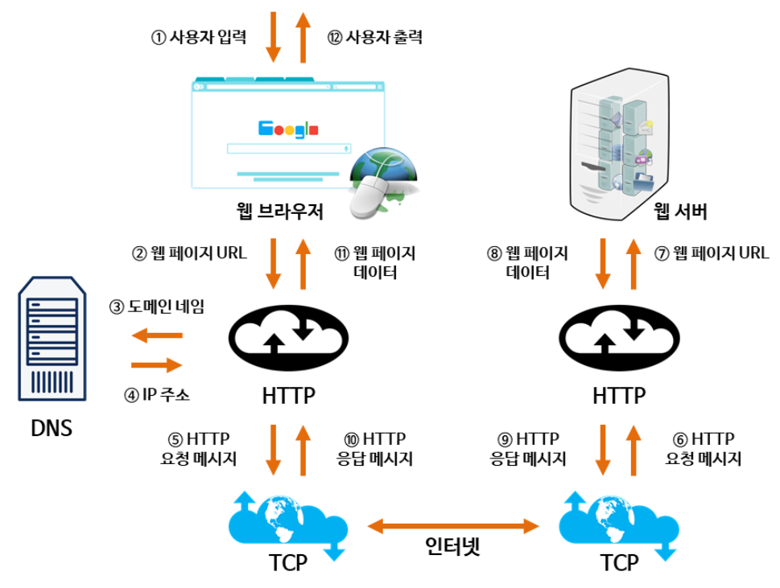

### 웹 동작 방식

<!--  -->

1. 사용자가 브라우저에 URL을 입력
2. 브라우저는 DNS를 통해 서버의 진짜 주소를 찾음
3. HTTP 프로토콜을 사용하여 HTTP 요청 메세지를 생성함
4. TCP/IP 연결을 통해 HTTP요청이 서버로 전송됨
5. 서버는 HTTP 프로토콜을 활용해 HTTP 응답 메세지를 생성함
6. TCP/IP 연결을 통해 요청한 컴퓨터로 전송
7. 도착한 HTTP 응답 메세지는 웹페이지 데이터로 변환되고, 웹 브라우저에 의해 출력되어 사용자가 볼 수 있게 됨

출처: [[기술면접] CS 기술면접 질문 - 네트워크 (4/8) - MangKyu's Diary](https://mangkyu.tistory.com/91)
