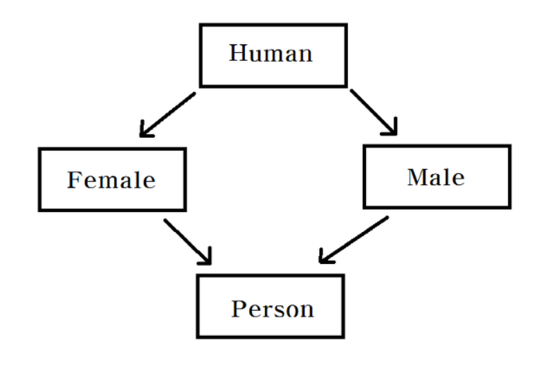

### JAVA에서 다중 상속을 지원하지 않는 이유

다중 상속을 지원하면 다이아몬드 문제가 발생할 수 있기 때문입니다. 예를 들어 Human 클래스에 있는 walk() 메소드를 Female 클래스와 Male 클래스가 모두 구현하였다고 할 때, Female과 Male 클래스를 다중 상속 받은 Person 클래스의 입장에서는 코드의 충돌이 생기기 때문입니다.

