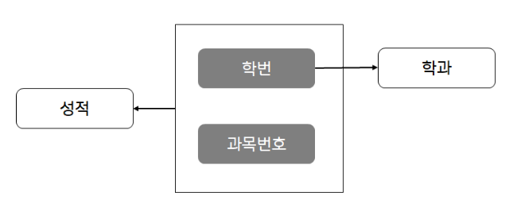

### 함수적 종속

- 어떤 테이블 R에서 X와 Y를 각각 R의 속성집합의 부분집합이라고 할때, 속성 X의 값 각각에 대해 시간에 고ㅓㅏㄴ계없이 항상 속성 Y의 값이 오직 하나만 연관되어 있을 때는 Y는 X에 함수적 조속 또는 X가 Y를 함수적으로 결정한다고 한다. X->Y로 표기한다.
- 함수적 종속은 데이터 의미를 표현하는 것으로, 현실 세계를 표현하는 제약조건이 되는 동시에 데이터 베이스에서 항상 유지되어햐 할 조건이다.

. X => Y 의 관계를 갖는 속성 X와 Y에서, X를 결정자, Y를 종속자라고한다.

### 완전 함수적 종속

- ** 어떤 속성이 기본키에 대해 완전히 종속적일 때 **
- 종속자가 기본키에만 종속되며, 기본키가 여러 속성으로 구성되어 있을 경우, 기본키를 구성하는 모든 속성이 포함된 기본키의 부분집합에 종속된 경우
- {학번, 과목번호 } -> 성적

### 부분 함수적 종속

- ** 기본키의 일부에 의해서 결정 될때 **
- 릴레이션에서 기본키가 복합키일 경우 기본키를 구성하는 속성 중 일부에게 종속된 경우
- 학번 -> 학과
